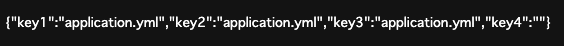
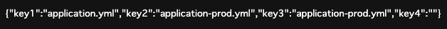
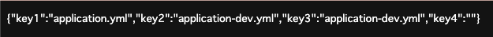
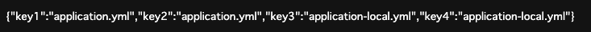
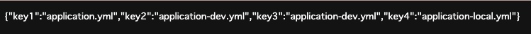
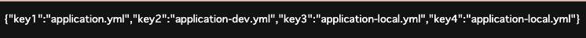
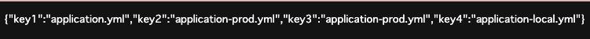
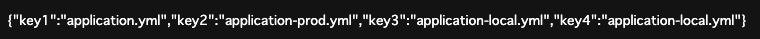

# spring-profiles-active-test

SPRING_PROFILES_ACTIVEの優先順位の確認

- 指定がなければapplication.ymlを読み込む
- １つ指定があればその値でapplication.ymlの値を上書きする
- ２つ指定があれば指定した順番に適用して後ろの値で上書きされる

| No  | Case       |key1| key2                 | key3                  | key4                  |
|-----|------------|---|----------------------|-----------------------|-----------------------|
| 1   | 指定なし       |application.yml| application.yml      | application.yml       |                       |
| 2   | prod       |application.yml| application-prod.yml | application-prod.yml  |                       |
| 3   | dev        |application.yml| application-dev.yml  | application-dev.yml   |                       |
| 4   | local      |application.yml| application.yml  | application-local.yml | application-local.yml |
| 5   | local,dev  |application.yml| application.yml  | application-dev.yml   | application-local.yml |
| 6   | dev,local  |application.yml| application.yml  | application-local.yml | application-local.yml |
| 7   | local,prod |application.yml| application.yml  | application-prod.yml  | application-local.yml |
| 8   | prod,local |application.yml| application.yml  | application-local.yml | application-local.yml |

## Case1 指定なし

```shell
./gradlew bootRun
```



## Case2 prod

```shell
SPRING_PROFILES_ACTIVE=prod ./gradlew bootRun
```



## Case3 dev

```shell
SPRING_PROFILES_ACTIVE=dev ./gradlew bootRun
```



## Case4 local

```shell
SPRING_PROFILES_ACTIVE=local ./gradlew bootRun
```



## Case5 local, dev

```shell
SPRING_PROFILES_ACTIVE=local,prod ./gradlew bootRun
```



## Case6 dev, local

```shell
SPRING_PROFILES_ACTIVE=prod,local ./gradlew bootRun
```



## Case7 local, prod

```shell
SPRING_PROFILES_ACTIVE=local,prod ./gradlew bootRun
```



## Case8 prod, local

```shell
SPRING_PROFILES_ACTIVE=prod,local ./gradlew bootRun
```


